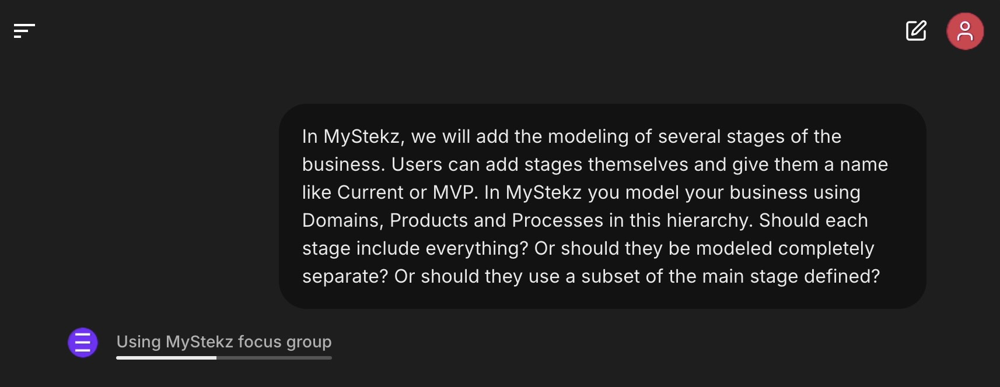
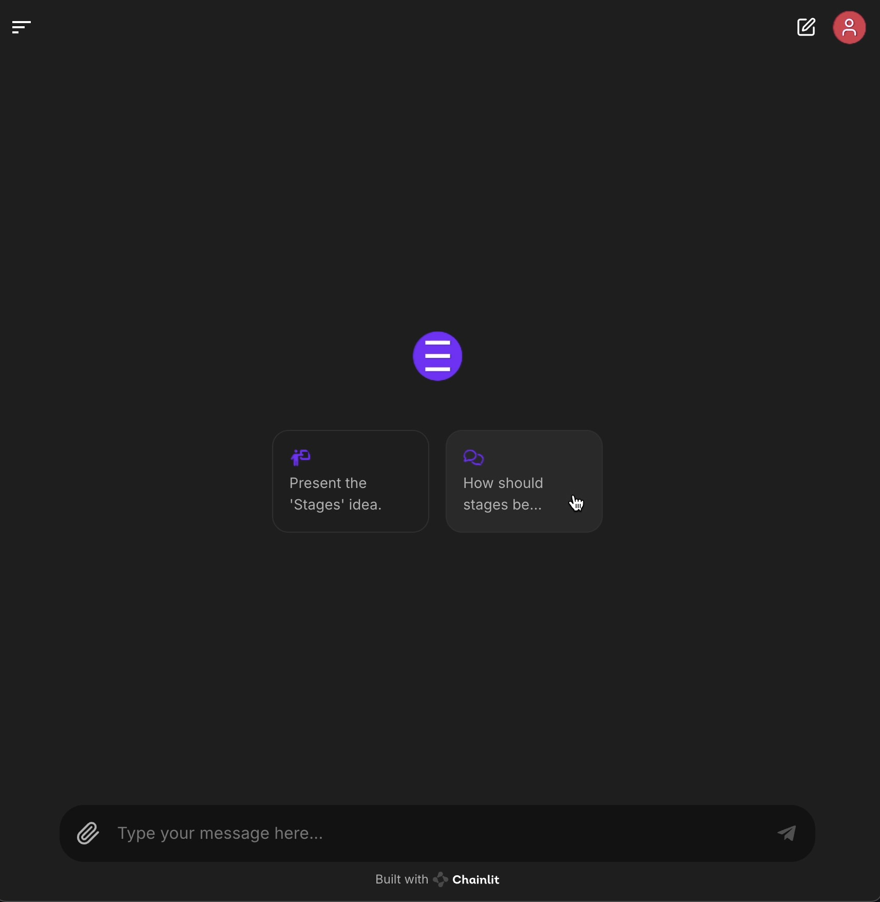

# MystekzFocusGroup Crew

Chat with the MyStekz focus group!



## Installation

Ensure you have Python >=3.10 <=3.13 installed on your system. This project uses [Poetry](https://python-poetry.org/) for dependency management and package handling.

First, if you haven't already, install Poetry.

Next, navigate to your project directory and install the dependencies:

1. First lock the dependencies and install them by using the CLI command:
  ```bash
  poetry install
  poetry run crewai install
  ```

2. Add your `OPENAI_API_KEY` into the `.env` file.

3. To boot up the chat interface, run the following in your CLI:
  ```bash
  poetry run chat
  ```
  Or, when developing, you can run:
  ```bash
  poetry run chat_watch
  ```

Either way you run it, logging is everywhere set to be very, very verbose. This helps with understanding what's happening with the different agents.

Your browser should open with something like this:



## Project setup

### Main
The main entry point of the project is `src/mystekz_focus_group/__main__.py`. This is where the chat interface is setup.

### Agents
Are defined in `src/mystekz_focus_group/agents.py`.

### Crew and Tasks
Are defined in `src/mystekz_focus_group/crew.py`.
